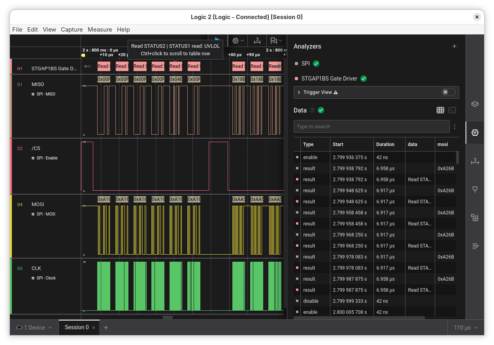

# STGAP1BS Gate Driver SPI Protocol Analyzer for Saleae Logic 2

This analyzer is able to decode the SPI communication protocol used by the
STGAP1BS gate driver IC from STMicroelectronics. It also supports older
STGAP1AS devices.

It is capable of automatically determining the number of devices in a
daisy-chained configuration, and decoding pipelined register reads and writes.

## Installation

In Logic 2 go to the Extensions tab on the RHS of the window, then search for "STGAP1BS Gate Driver" in the Extension Store and click Install.

## Development

1. Clone this repo
2. Open Logic 2 and go to the Extensions tab
3. Under the three dot, more menu, click `Load Existing Extension...` and then select the local repo location.

## Usage

The analyzer expects to see SPI traffic with the following settings:

- MSB first
- 16 bits per transfer
- Clock Low when inactive (CPOL=0)
- Data is valid on  Clock Trailing Edge (CPHA=1)
- Enable Line is active low

The analyzer will determine the number of devices in the daisy chain automatically based on the number of frames seen in each enable. Commands are pipelined, so the results of register reads will be seen in subsequent transfers. The results of a register read appear separated by `|` characters in the output data field.

## References

- [STGAP1BS Datasheet](https://www.st.com/resource/en/datasheet/stgap1bs.pdf)
- [STGAP1AS Datasheet](https://www.st.com/resource/en/datasheet/stgap1as.pdf)
